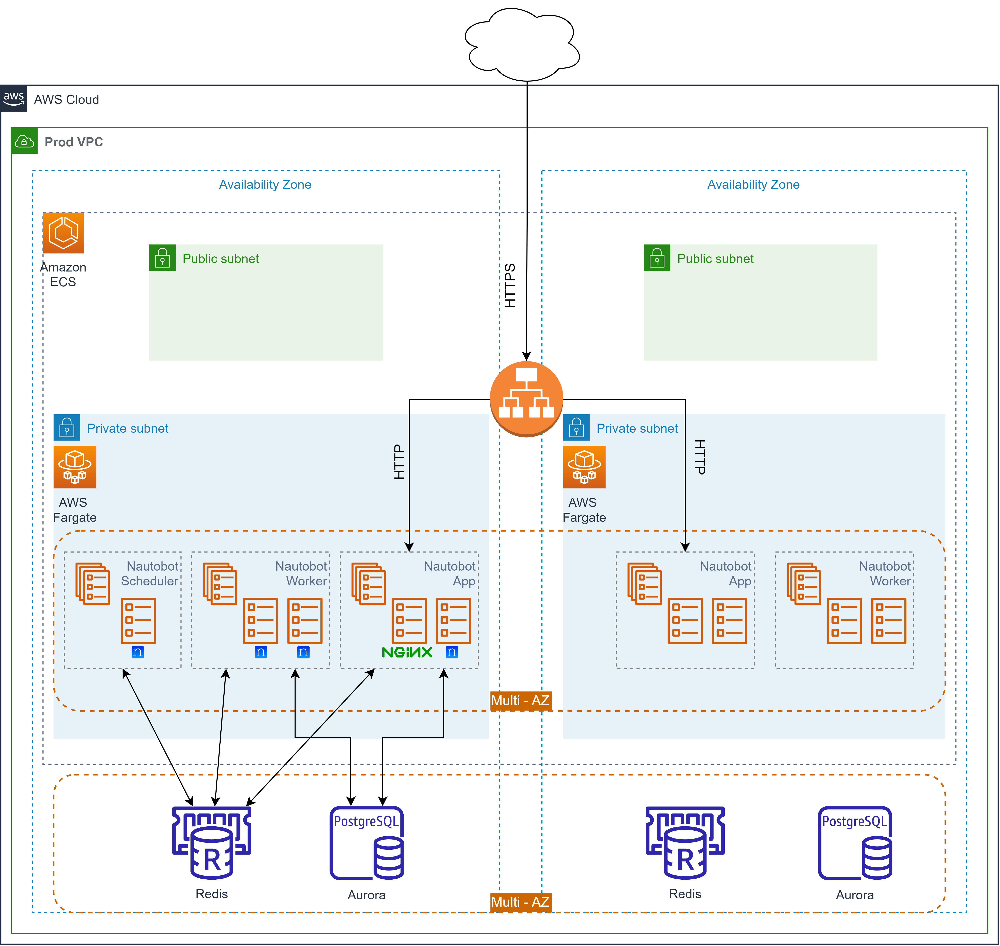

# Nautobot AWS CDK Deployment

This project contains the AWS CDK code to deploy Nautobot to AWS. The CDK code was influenced by the [Nautobot In AWS Fargate](https://blog.networktocode.com/post/nautobot-in-aws-fargate/) blog post by [Network to Code](https://www.networktocode.com/). However, the mentioned blog post is missing a lot of details about Redis and back end database (Postgres in this case). Other differences are the simplification of building the Docker images and ECR which allows for plugin installation and custom attributes to be set in the `nautobot_config.py` file for the Nautobot container and the use of AWS Secrets Manager to store secrets.

## SSM - Accessing Containers

If there is a need to access the containers, AWS SSM provides a way to do this. The following commands can be used to access the containers:

- `ssm.sh` - SSM into a Cluster's Service
- `./ssm.sh --help` - Get Help

Example (These values can be grabbed from AWS Console)

```bash
./ssm.sh NautobotCluster NautobotFargateEcsStack-NautobotAppServiceC59AF503-aiiGAlPRpYMd
```

## Architecture



The `cdk.json` file tells the CDK Toolkit how to execute your app.

## Useful commands

* `npm run build`   compile typescript to js
* `npm run watch`   watch for changes and compile
* `npm run test`    perform the jest unit tests
* `cdk deploy`      deploy this stack to your default AWS account/region
* `cdk diff`        compare deployed stack with current state
* `cdk synth`       emits the synthesized CloudFormation template

## Project Structure

This project is structured to use AWS CDK to build and deploy a Nautobot application using ECS Fargate, with its data stored in RDS PostgreSQL and cached in ElastiCache Redis.

### File Descriptions

The following files and directories represent the core components of the application:

- `nautobot-app`: This directory contains the Dockerfile and other necessary files to build the Docker image for the main Nautobot application.
  - `Dockerfile`: Describes the Docker image for the Nautobot application.
  - `nautobot_config.py`: The configuration file for Nautobot.
  - `requirements.txt`: Lists the Python dependencies for the Nautobot application.
  - `README.md`: Describes the contents of the `nautobot-app` directory.
- `nautobot-db-stack.ts`: Defines the AWS CDK Stack to set up the Amazon RDS for PostgreSQL database and Amazon ElastiCache for Redis cache.
- `nautobot-docker-image-stack.ts`: Defines the AWS CDK Stack to build the Docker image from the local Dockerfile for the main Nautobot container.
- `nautobot-fargate-ecs-stack.ts`: Defines the AWS CDK Stack to set up the ECS Fargate service for the Nautobot application.
- `nautobot-secrets-stack.ts`: Defines the AWS CDK Stack to manage AWS Secrets Manager secrets for the Nautobot application.
- `nautobot-vpc-stack.ts`: Defines the AWS CDK Stack to set up the VPC for the Nautobot application.
- `nginx`: This directory contains the Dockerfile and configuration file for the NGINX server.
  - `Dockerfile`: Describes the Docker image for the NGINX server.
  - `nginx.conf`: The configuration file for the NGINX server.
- `nginx-docker-image-stack.ts`: Defines the AWS CDK Stack to build the Docker image from the local Dockerfile for the NGINX server.
- `secrets`: This directory contains an example environment file.
  - `env-example`: An example of the environment variables to be used in the application.

## How to Run

### Secrets and Environment Variables

There are two `.env` in this project that are used for the Nautobot Application service. The more sensitive information is under `/lib/secrets/env-example`. This file is used to create the AWS Secrets Manager secret. The other `.env` file is under `/lib/nautobot-app/.env-example`. This file is used to set the environment variables for the Nautobot application.  The `/lib/secrets/.env-example`  and `lib/nautobot-app/.env-example` files are meant to be edited and then renamed or copied `.env` before running the CDK stack.

### CDK Bootstrap and Deploy

Ensure that you have proper AWS credentials set up on your machine. Then, run the following commands:

Bootstrap CDK environment to your AWS account

```bash
cdk bootstrap
```

Deploy the stacks

```bash
cdk deploy --all
```

## How to Destroy

1. Manually delete the `namespace` in ECS (Usually this holds it up). Once this is complete, you can run the following command to destroy the stacks:

```bash
cdk destroy
```
